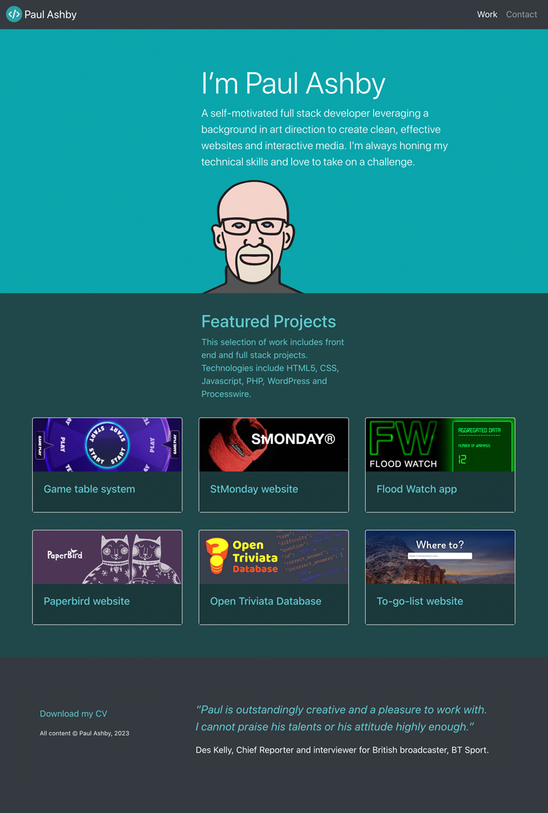

# React Portfolio

  
Portfolio showcasing my full stack development work. The site gives a brief overview of my work experience and skills and includes a gallery of featured projects as well as a contact page including a contact form with a PHP back end.

This single page app uses class-based stateful React components and the react-router-dom NPM package for routing.

You can view the deployed site [here](https://paulashby.github.io/react-portfolio).

